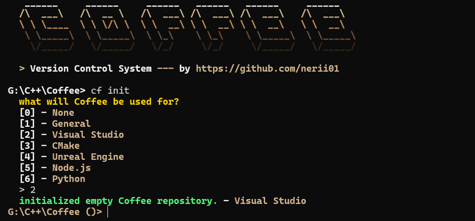
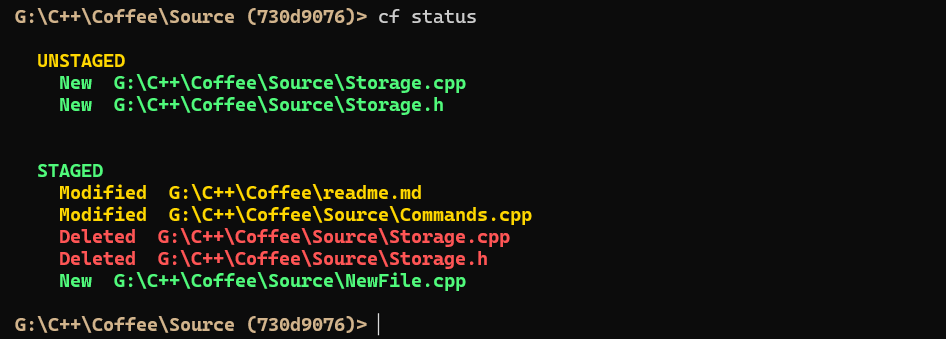
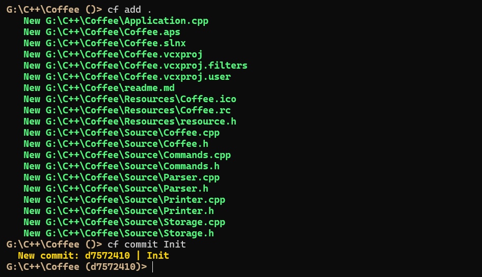
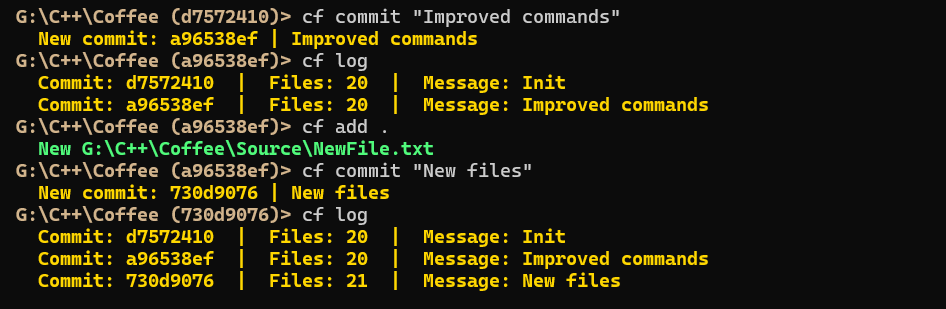
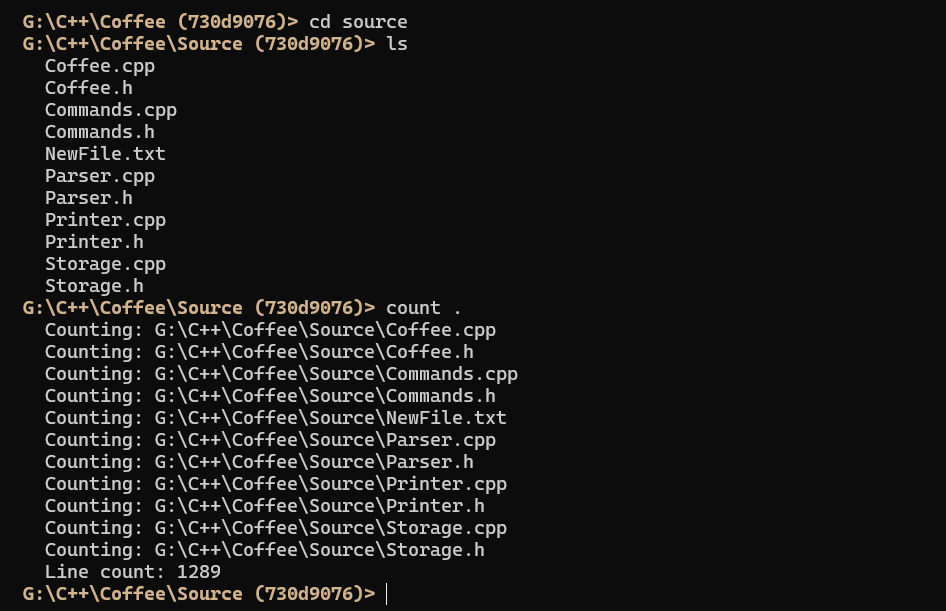

#  Coffee

**Coffee** is a mini git-like version control system written in C++ — built from scratch as a standalone CLI tool with its own shell, commit history, file tracking and basic system commands.

---

## ✨ Highlights

- Initialize repositories and track file changes
- Stage files and create commits with messages
- Checkout any previous commit by hash
- View full commit history with `cf log`
- Colored terminal UI with a custom prompt
- Built-in shell commands — `ls`, `cd`, `cat`, `mkdir`, `touch`, `count`
- `.cfignore` support with presets for C++, UE5, Node.js and more
- Tab completion for file and directory names
- mtime + hash caching for fast index diffing

---

## 🖼️ Screenshots

### Startup & `cf init`



### `cf status`



### `cf add` & `cf commit`



### `cf commit` & `cf log`



### `count .` & `ls`



### `cat file > newFile`


---

## 🚀 What I Built

### Version Control Core

Coffee implements the essential git workflow — init, add, commit, checkout — using a flat object store where each file, tree and commit is saved as a hashed blob under `.cf/objects/`.

### Custom Shell

Instead of wrapping an existing shell, Coffee runs its own input loop with a styled prompt that shows the current directory and HEAD commit hash. Tab completion and `~` expansion are built in.

### Index & Diff Engine

File tracking uses a four-field index (`path|hash|size|mtime`). On `cf add`, Coffee walks the working directory, compares against the cached index using mtime and size first, only recomputing the hash when needed.

### Object Store

Commits, trees and blobs are stored as content-addressed files in `.cf/objects/` using FNV-1a hashing. A `commits` helper file keeps a flat log for fast `cf log` output without traversing the object graph.

### Clean Architecture

The codebase is split into `Coffee`, `Commands`, `Storage`, `Parser` and `Printer` — each with a clear responsibility. Colors and styles live in `printer::` as `constexpr` constants.

---

## ⌨️ Commands

### Version Control

```
cf init                   Initialize a new Coffee repository
cf add .                  Stage all files
cf add <file>             Stage a specific file
cf commit <message>       Commit staged changes
cf checkout <hash>        Restore working directory to a commit
cf status                 Show staged and unstaged changes
cf log                    Display commit history
```

### Shell

```
ls                        List directory contents
cd <dir>                  Change directory  (supports ~)
mkdir <dir>               Create a directory
touch <file>              Create an empty file
cat <file>                Print file contents
cat <file> > <new>        Overwrite file
cat <file> >> <new>       Append to file
cat .                     Print all files in current directory
count <file>              Count lines in a file
count .                   Count lines across all files
```

---

## 🗂️ Object Model

```
.cf/
├── HEAD          →  current commit hash
├── index         →  staged files  (path|hash|size|mtime)
├── commits       →  flat log      (hash|fileCount|message)
└── objects/
    ├── <blob>    →  raw file content
    ├── <tree>    →  tree\n<index lines>
    └── <commit>  →  commit|tree|parent|message
```

---

## 🛠️ Requirements

- C++20 or newer
- Visual Studio 2022 / MSVC
- Windows (uses `SetConsoleOutputCP`, `_getch`)

---

## 📁 Project Structure

```
Coffee/
├── Coffee.h / Coffee.cpp       Core loop, input processing
├── Commands.h / Commands.cpp   All command implementations
├── Storage.h / Storage.cpp     Index, objects, hashing, diffing
├── Parser.h / Parser.cpp       Tokenizer and split utilities
├── Printer.h / Printer.cpp     Colors, banner, console output
└── main.cpp
```

---

## 📌 Notes

Built with focus on:

- `std::filesystem` for portable path handling
- `std::views::split` and `std::ranges` for parsing
- Content-addressed storage (FNV-1a)
- mtime caching to avoid rehashing unchanged files
- Separation of concerns across dedicated translation units

---

## 📫 Author

GitHub: https://github.com/Nerii10
